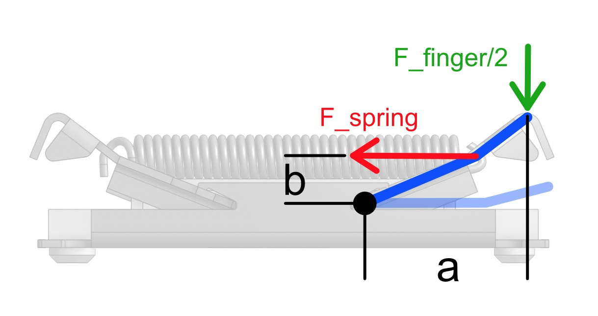
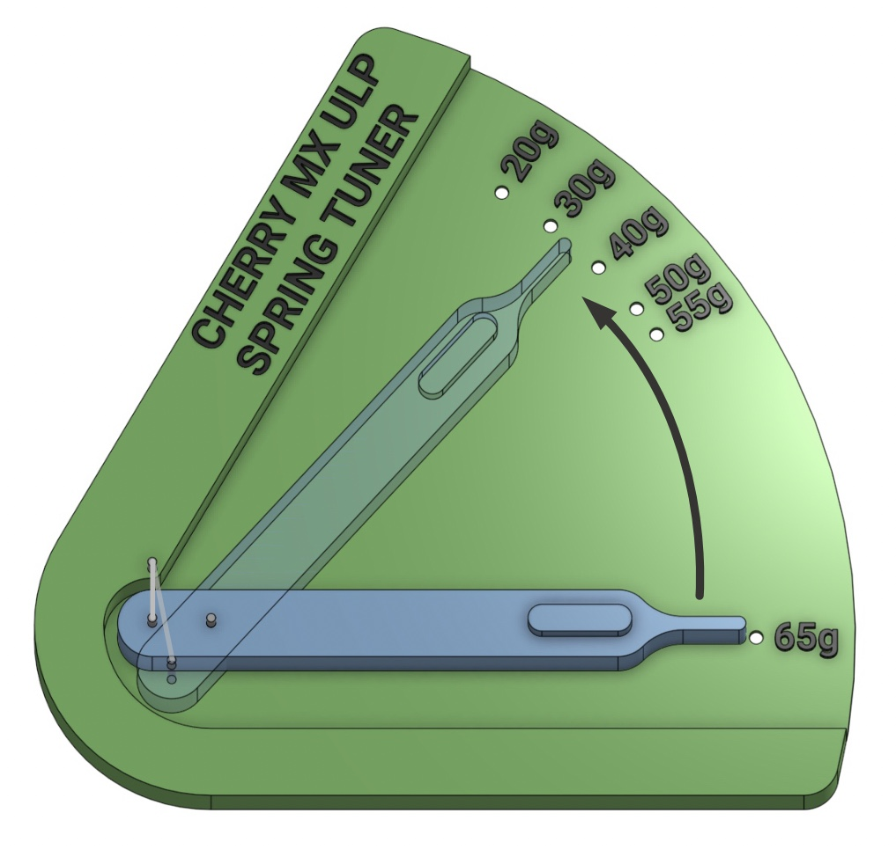
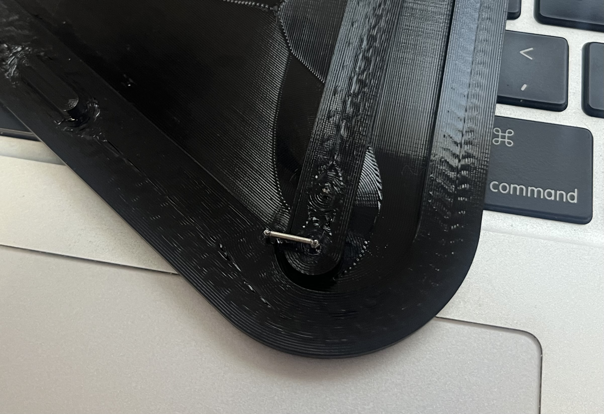

# Cherry MX ULP Spring-Tuner

*This is a simple 3D printed tool that allows you to lower the actuation force of Cherry MX ULP switches from the factory 65g down to whatever your preferred firmness is. I gathered stretch vs switch actuation force data from three springs and put the resulting switch actuation forces directly on the part as gradations to make it as easy as possible. You'll be able to uninstall a spring, tune, and reinstall in about 30s after getting used to the process a couple times.*

## Background 
Mechanical butterfly style switch like this achieves a “tactile” feel with just a hooked extension spring and clever geometry. See the free body diagram below. Both switch “wings” are pivoting levers dictated by the balance between the moment applied by your finger and the counter moment applied by the spring. The relationship between these two creates the tactile buckling sensation, eventually collapsing as the spring moment arm approaches zero. 

The force to actuate the switch in this mechanism is entirely proportional to the spring tension force, which can either be changed by altering the spring stiffness or its change in length. This spring is quite a bit smaller than what’s commonly available online, so I focused on a method to tune the spring length. The benefit here is no extra parts are needed other than stuff you probably already have, the downside is this change is irreversible. 

Two challenges immediately present themselves: these springs are tiny, which makes handling them a bit tedious; and a very repeatable motion is necessary to achieve the same permanent set reliably. Both challenges are solved by using a lever system to scale large motion into very small. The tool for this is just two 3D printed parts that are joined by press fitting a section of wire from a breadboard jumper cable end or a small paperclip (you should be able to use what you have lying around, this doesn't need to be exact). 

## Instructions 
1. Print the Spring_tuner_base.stl and Spring_tuner_arm.stl files. Print with 3-4 wall layers. I used PETG, but I'm sure PLA would work fine. 
2. Press a short section of wire into the three pin holes (two in the base, one on the arm). The wire should be about 0.64mm (0.025in) in diameter. I found the end of a breadboard jumper cable was perfect. Snip these wires 4-6mm above the surface.
3. Press the arm onto the pivot pin on the base. Installing a pin here helps keep the two pieces well-aligned for a consistent spring length with the tool gradations. The arm should sit flush against the surface of the base.
4. Carefully unhook the spring from the switch arms, one side at a time with precision tweezers, and install it onto the two exposed tool pins. Ensure to install by passing the spring hooks over the top of the pins rather than forcing the hooks around the side of the pin to prevent bending the fragile ends.
5. Press the arm flat aginst the base and pivot the arm to the actuation force you want. Hold the arm there for a couple seconds and release gently. Note: The large gap between the 65g and 55g gradations is the displacement that's needed to overcome elastic elongation of the spring and enter the range where the spring will no longer relax to the original length! 
6. Remove the spring from the tool by carefully pulling straight up. Reinstall the spring on the keyswitch, one side at a time. The switch has two sets of holes, be sure to use the right ones (furthest from the electrical connections).
7. Repeat steps 4-6 for the remaining switches. 

## Tips for success 
- A small dot of gel CA glue on the pin holes may be necessary to keep the pins firm if your printer leave the holes too loose. 
- Giving the pins a light lead in chamfer with a diamond file is helpful for getting the springs onto the tool. Especially if the wire snips left burrs on the ends of the pins. 
- Precision tweezers are a must for handling the springs at all. These springs are so small that they will fly across the room if they slip off whatever is holding them while even a little stretched. Yes, that happened to me on carpet. Learn purely vicariously through me on that one.
- Holding the wings of the switch together with your fingers while removing the spring with tweezers can help prevent the wings from coming off the base. The switch can be reassembled if it comes apart, but this is a little annoying.
- Sometimes the spring hooks may feel like they're caught on the pins. Be careful not to accidently apply any bending load to the spring in a way that could deform the wire in an unintended direction. Just gently rock the spring back and forth to free it so it can be removed without force. 
- Make sure the arm is pressed flat against the base when loading the spring to keep the results consistent.
- The orientation of the spring on the tool may matter if you're stretching it below 30g of switch actuation force. The spring hooks begin to open up by a tiny amount at these loads. This is inconsequential for the spring when used on a switch because this level of loading is never applied again. Orient the spring so the hook openings are facing the arm tip. This reduces the chance of the spring liberating from the pins. 
